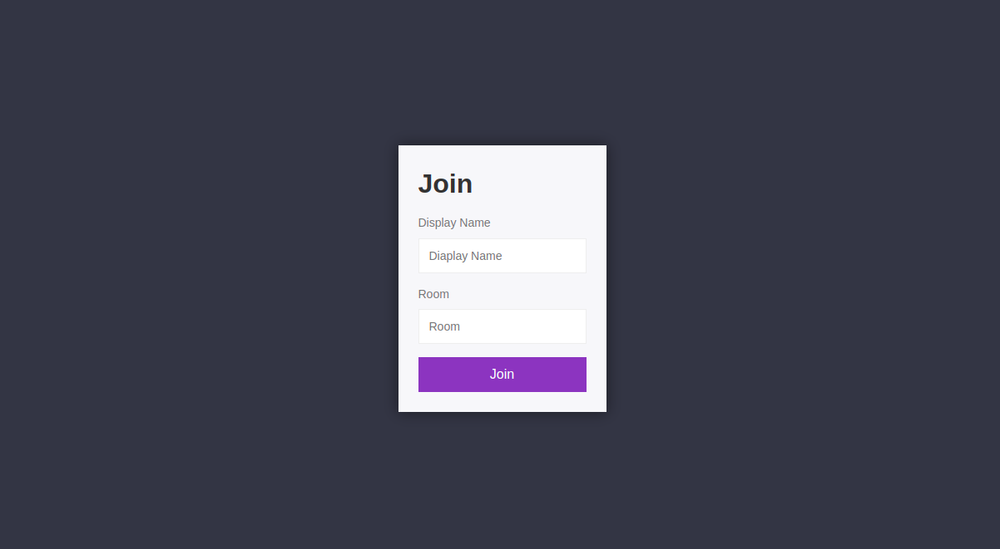
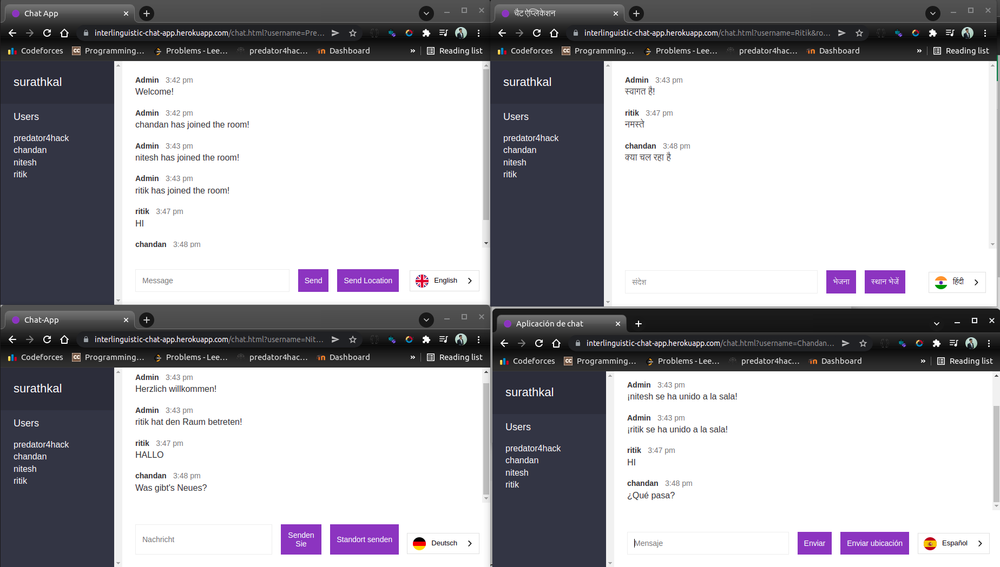
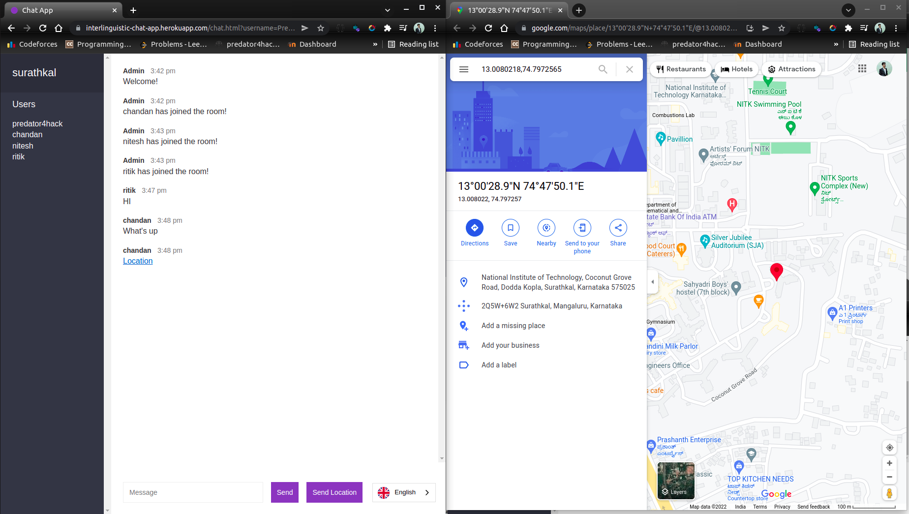

# Interlinguistic Chat Application

A web-application that allows users to chat in their native language. Users from all around the world can create and join chat rooms. Furthermore, the software allows users to publish their current location if desired.

## Deployment

Deployed on [heroku](https://interlinguistic-chat-app.herokuapp.com/)

## Screenshots

### Dashboard to join a chat room



### Chat in different languages



### Share your location



## Tech Stack

**Client:** HTML, CSS, JavaScript, TailwindCSS

**Server:** NodeJS, Socket.io

## Environment Variables

To run this project, you will need to add the following environment variables to your .env file

`WEGLOT_LANGUAGE_API`

## Run Locally

Clone the project

```bash
  git clone https://github.com/predator4hack/Interlinguistic-Chat-Application
```

Go to the project directory

```bash
  cd Interlinguistic-Chat-Application
```

Install dependencies

```bash
  npm install
```

Start the server

```bash
  npm start
```

## Roadmap

-   User Dashboard

-   Decentralized and more secure

## Authors

-   [@predator4hack](https://github.com/predator4hack)
